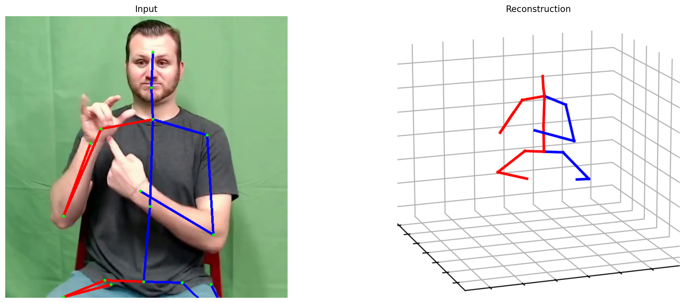

# PoseFormerV2: Environment & Inference Instructions

> 
>
> A sample frame from the produced overlay video (PoseFormerV2 on a test clip).

This README documents how to **install** and **run** PoseFormerV2 on a CUDA-enabled cluster using the two helper scripts you created:

- `pose_estimators/PoseFormerV2/environment_setup.sh` — creates the `poseformerv2` conda env and installs dependencies.
- `pose_estimators/PoseFormerV2/inference.sh` — runs the demo visualizer on a video.

> ⚠️ **Weights are required.** You must download the detector and pose weights exactly as instructed by the **official PoseFormerV2 repo**:  
> https://github.com/QitaoZhao/PoseFormerV2

---

## Directory Layout (relevant bits)

```
pose_estimators/PoseFormerV2/
├── environment_setup.sh   # this README refers to it
├── inference.sh           # this README refers to it
└── media/
    └── 0134_pose.png      # example frame used in this README
```

You also need the official PoseFormerV2 code cloned, e.g.:

```
/home/gsantm/repositories/PoseFormerV2/   # official repository (code lives here)
```

---

## Prerequisites

- A cluster/node with:
  - CUDA 11.8 toolchain available as a **module** (or equivalent)
  - A100 (or compatible NVIDIA) GPU
  - Conda/Mamba available as modules
  - Internet access to download Python wheels and model weights
- The **module** system must provide at least these (edit names if your cluster differs):
  - `a100`
  - `cuda/11.8.0`
  - `mamba/24.9.0-0`

>**Note:** The paths in the scripts and this README are preconfigured for my environment; please update them to match your own directory structure and filenames before running anything.

> The scripts also set:
> - `CONDA_ENVS_PATH=/home/gsantm/data/conda/envs`
> - `MAMBA_ROOT_PREFIX=/home/gsantm/data/conda`  
> Adjust if you prefer a different env location.

---

## What the scripts do

### 1) `environment_setup.sh`

This script (to be run inside the **official PoseFormerV2 repo folder** or with `requirements.txt` accessible):

1. Loads the cluster modules.
2. Creates a `conda` environment **`poseformerv2`** with **Python 3.9**.
3. Installs **PyTorch 1.13.0 + CUDA 11.7 wheels** (the official repo recommends cu117).
4. Installs the repo’s Python requirements: `pip install -r requirements.txt`.

The environment matches the **official guidance**:

```
Python 3.9
PyTorch 1.13.0
CUDA 11.7 (wheels labeled cu117)
```

**Run it:**
```bash
bash /home/gsantm/repositories/pose_estimators_study/pose_estimators/PoseFormerV2/environment_setup.sh
```

After a successful run, you can activate the environment anytime with:
```bash
module purge
module load a100
module load cuda/11.8.0
module load mamba/24.9.0-0
source activate poseformerv2
```

> Note: Using CUDA 11.8 on the cluster with cu117 wheels is fine; the binary wheels bundle their own CUDA runtime components.


---

### 2) `inference.sh`

This script:

1. Loads the modules, activates the `poseformerv2` env.
2. Sets `REPO_PATH` to your **official PoseFormerV2 repo** path.
3. Runs the video demo visualizer:
   ```bash
   python demo/vis.py --video test.mp4
   ```

By default, PoseFormerV2’s demo expects:
- Your video file to be available (commonly placed under `./demo/video/`).  
  You can pass a relative or absolute path via `--video`.

**Run it:**
```bash
bash /home/gsantm/repositories/pose_estimators_study/pose_estimators/PoseFormerV2/inference.sh
```

**Inputs/Outputs**
- **Input**: set by `--video`, e.g. `/home/gsantm/repositories/pose_estimators_study/pose_estimators/test.mp4`
- **Output**: the demo writes an overlay video (and optional intermediate results) as defined by the repo’s demo code (often under `demo/output/` or printed to console).

If your cluster/video player struggles to open the output MP4, you can do a *compatibility re-encode* (H.264 + yuv420p), for example:

```bash
ffmpeg -i <raw_output.mp4> -c:v libx264 -pix_fmt yuv420p -movflags +faststart PoseFormerV2_test_h264.mp4
```

---

## Required Weights (follow the official repo)

From the official README (**must** download):

1. **YOLOv3** weights (for detection) — download and place under:
   ```
   ./demo/lib/checkpoint/
   ```

2. **HRNet** weights (for 2D keypoints) — place under:
   ```
   ./demo/lib/checkpoint/
   ```

3. **PoseFormerV2** pretrained model(s) — default path used by code:
   ```
   ./checkpoint/
   ```
   The default model variant in the demo is `27_243_45.2.bin` (243-frame input).

> For the latest links and any additional instructions, refer directly to:  
> https://github.com/QitaoZhao/PoseFormerV2

- **Storage tip (highly recommended):** Large assets (detector weights, pretrained checkpoints, datasets) don’t need to live inside the cloned repo. To save quota and avoid duplication, store them in a high-capacity path (e.g., /scratch, /work, /lustre) and symlink the expected folders inside the repo:

   ```bash
   # link_dir <shared_path> <repo_path>
   # - If <repo_path> exists and has files, they are moved (not deleted) to <shared_path>.
   # - Finally, <repo_path> becomes a symlink to <shared_path>.
   link_dir() {
     local SRC="$1"   # e.g., /scratch/$USER/pose_assets/pretrained_models
     local DEST="$2"  # e.g., /home/gsantm/repositories/AlphaPose/pretrained_models
   
     mkdir -p "$SRC"
   
     # If DEST is already the correct symlink, we're done
     if [ -L "$DEST" ] && [ "$(readlink -f "$DEST")" = "$(readlink -f "$SRC")" ]; then
       echo "[ok] $DEST already links to $SRC"
       return 0
     fi
   
     # If DEST exists and is not a symlink, migrate its contents safely
     if [ -e "$DEST" ] && [ ! -L "$DEST" ]; then
       echo "[info] Migrating existing contents from $DEST -> $SRC"
       mkdir -p "$SRC"
       # Move files without overwriting; keep both if name clash (suffix ~)
       rsync -a --ignore-existing "$DEST"/ "$SRC"/
       # Move remaining (including clashes) with suffix
       rsync -a --backup --suffix='.~old~' "$DEST"/ "$SRC"/
       # Remove the original dir once migrated
       rm -rf "$DEST"
     fi
   
     # If DEST is a symlink to somewhere else, replace it
     if [ -L "$DEST" ] && [ "$(readlink -f "$DEST")" != "$(readlink -f "$SRC")" ]; then
       echo "[warn] $DEST is a symlink to a different target; updating to $SRC"
       rm -f "$DEST"
     fi
   
     # Create the symlink
     ln -sfn "$SRC" "$DEST"
     echo "[ok] Linked $DEST -> $SRC"
   }
  ```
  
  This keeps your repository small while preserving the original directory layout expected by the scripts.


---

## Quick Start

```bash
# 1) Clone the official repo (if not already)
git clone https://github.com/QitaoZhao/PoseFormerV2.git /home/gsantm/repositories/PoseFormerV2/

# 2) Download weights as per the official README
#    - YOLOv3 + HRNet -> /home/gsantm/repositories/PoseFormerV2/demo/lib/checkpoint/
#    - PoseFormerV2    -> /home/gsantm/repositories/PoseFormerV2/checkpoint/

# 3) One-time environment setup
bash /home/gsantm/repositories/pose_estimators_study/pose_estimators/PoseFormerV2/environment_setup.sh

# 4) Run the demo (uses --video test.mp4 per your script)
bash /home/gsantm/repositories/pose_estimators_study/pose_estimators/PoseFormerV2/inference.sh
```

To process a specific video, either place it where the demo expects (e.g., `demo/video/`) and pass the name, or pass an absolute path:

```bash
python demo/vis.py --video /home/gsantm/repositories/pose_estimators_study/pose_estimators/test.mp4
```

If you want a known-compatible MP4 afterward:
```bash
ffmpeg -i <raw_output.mp4> -c:v libx264 -pix_fmt yuv420p -movflags +faststart \
  /home/gsantm/repositories/pose_estimators_study/pose_estimators/PoseFormerV2/PoseFormerV2_test_h264.mp4
```

---

## Troubleshooting

- **“File not found” for weights**  
  Ensure you placed YOLOv3 + HRNet under `demo/lib/checkpoint` and the PoseFormerV2 `.bin` model(s) under `checkpoint/` in the official repo folder.

- **Video cannot be played (e.g., VS Code/QuickTime)**  
  Re-encode using the `ffmpeg` command above to H.264 (`PoseFormerV2_test_h264.mp4`).

- **CUDA / PyTorch mismatch**  
  The environment uses PyTorch 1.13.0 + cu117 wheels. Keep the cluster’s CUDA driver reasonably up-to-date (11.7+).

- **Module names differ on your cluster**  
  Edit the `module load ...` lines at the top of each script.

- **Where is the output saved?**  
  The demo prints/save paths; many repos derived from MHFormer store under `demo/output/`. Check your console logs for the exact location used by your cloned version.

---

## Reproducibility Notes (versions)

- Python **3.9**
- PyTorch **1.13.0** (cu117 wheels) + torchvision **0.14.0** (cu117) + torchaudio **0.13.0**
- CUDA 11.7 wheels (works fine when running on a CUDA 11.8 module on the cluster)
- Remaining packages from `requirements.txt` in the official repo

These match the **official PoseFormerV2** environment guidance and have been reflected in your `environment_setup.sh`.
