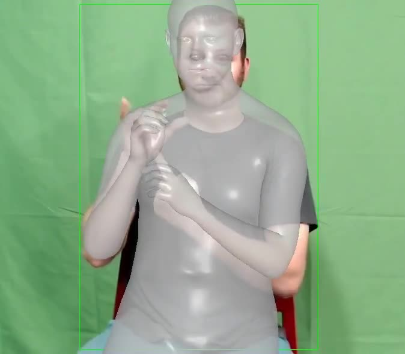

# SMPLest-X: Environment & Inference Instructions

> 
>
> A sample frame extracted from the rendered output video (SMPLest‑X on a test clip).

This README explains how to **install** and **run** SMPLest‑X on a CUDA-enabled cluster using the helper scripts you created:

- `pose_estimators/SMPLest-X/environment_setup.sh` — creates the `smplestx` conda env and installs dependencies.
- `pose_estimators/SMPLest-X/inference.sh` — runs the official `scripts/inference.sh` on a chosen video.

> ⚠️ **You must still follow the official repo for models and assets** (SMPL/SMPL‑X body models, pretrained checkpoints, etc.):  
> https://github.com/SMPLCap/SMPLest-X

> **Paths notice:** The scripts and examples in this README use **hardcoded paths from my setup** (under `/home/gsantm/...`). **Update all paths** to match your filesystem layout before running.

---

## Directory Layout (relevant bits)

```
pose_estimators/SMPLest-X/
├── environment_setup.sh   # this README refers to it
├── inference.sh           # this README refers to it
├── download_model.py      # downloads the SMPLest-X Huge checkpoint to your store folder
└── media/
    └── 134.jpg            # example frame used in this README
```

You should also have the official SMPLest‑X repository cloned, for example:

```
/home/gsantm/repositories/SMPLest-X/   # official repository (code lives here)
```

---

## Prerequisites

- A cluster/node with:
  - CUDA 11.8 toolchain available as a **module** (or equivalent)
  - A100 (or compatible NVIDIA) GPU
  - Conda/Mamba available as modules
  - Internet access to download Python wheels and model weights
- The **module** system should provide at least these (edit names if your cluster differs):
  - `a100`
  - `cuda/11.8.0`
  - `mamba/24.9.0-0`

> The scripts also set:
> - `CONDA_ENVS_PATH=/home/gsantm/data/conda/envs`
> - `MAMBA_ROOT_PREFIX=/home/gsantm/data/conda`  
> Adjust if you prefer a different env location.

---

## What the scripts do

### 1) `environment_setup.sh`

This script:

1. Loads cluster modules and ensures env dirs exist.
2. Creates a conda environment **`smplestx`** with **Python 3.8**.
3. Installs **PyTorch 1.12.0 + CUDA 11.3** wheels (as per your working setup).
4. Installs the official repo’s `requirements.txt`.
5. Installs **OSMesa** userspace (`mesalib`) to support headless rendering via PyOpenGL.

**Run it:**
```bash
bash /home/gsantm/repositories/pose_estimators_study/pose_estimators/SMPLest-X/environment_setup.sh
```

After a successful run, activate the environment anytime with:
```bash
module purge
module load a100
module load cuda/11.8.0
module load mamba/24.9.0-0
source activate smplestx
```

> **Headless rendering note:** This pipeline uses offscreen rendering. We set `PYOPENGL_PLATFORM=osmesa` (see `inference.sh`) and install `mesalib` so PyOpenGL can create an offscreen context without a display/GUI.

---

### 2) `inference.sh`

This script:

1. Loads the modules and activates the `smplestx` env.
2. Exports `PYOPENGL_PLATFORM=osmesa` for headless rendering.
3. Sets the model directory name, input file name, and FPS for the official script.
4. Invokes the **official** SMPLest‑X script:
   ```bash
   sh scripts/inference.sh {MODEL_DIR} {FILE_NAME} {FPS}
   ```

The existing version uses:
```bash
export MODEL_DIR="smplest_x_h"
export FILE_NAME="test.mp4"
export FPS=50

cd /home/gsantm/repositories/SMPLest-X
sh scripts/inference.sh ${MODEL_DIR} ${FILE_NAME} ${FPS}
```

**Run it:**
```bash
bash /home/gsantm/repositories/pose_estimators_study/pose_estimators/SMPLest-X/inference.sh
```

**Inputs/Outputs (by official repo):**
- **Input video**: place under `SMPLest-X/demo` (e.g., `demo/test.mp4`).
- **Output**: results and rendered videos are saved under `SMPLest-X/demo` (e.g., `demo/result_test.mp4`).

If you need a *compatibility re-encode* (H.264 + yuv420p) for problematic players:
```bash
ffmpeg -i demo/result_test.mp4 -c:v libx264 -pix_fmt yuv420p -movflags +faststart \
  demo/SMPLest-X_test_h264.mp4
```

---

## Models & Assets (follow the official repo)

From the official README, you need to prepare:

1. **SMPLest‑X pretrained model** (Huge variant shown here):
   - Download the **SMPLest-X-Huge** weight from Hugging Face.
   - Place under: `SMPLest-X/pretrained_models/smplest_x_h/smplest_x_h.pth.tar`
   - Your helper script does this automatically:
     ```bash
     python /home/gsantm/repositories/pose_estimators_study/pose_estimators/SMPLest-X/download_model.py
     ```

2. **Parametric human models**:
   - Download **SMPL-X** and **SMPL** from the official sites.
   - Place them under: `SMPLest-X/human_models/` (exact structure expected by the repo).

3. **YOLO detector**:
   - The pretrained YOLO model is downloaded automatically on first use.

> For training (not needed for the simple demo), the repo references **ViT‑Pose** weights via OSX; see the official instructions if you plan to train.

---

## Shared storage layout (symlink-friendly, replicable)

To save home/data quota and avoid duplicating large files, place heavy assets (videos, pretrained models, SMPL-X body models) in a **shared store path** and link them into the official repo.

Below is a **replicable layout** of the store directory and the matching **symlinks** inside the official `SMPLest-X` repo. Adjust `STORE_ROOT` and `REPO_ROOT` as needed.

```bash
# Edit these paths to your system:
export STORE_ROOT="/home/<USER>/store/pose_estimators/SMPLest-X"
export REPO_ROOT="/home/<USER>/repositories/SMPLest-X"

# 1) Create the shared store structure
mkdir -p "$STORE_ROOT/pretrained_models/smplest_x_h"
mkdir -p "$STORE_ROOT/demo"
mkdir -p "$STORE_ROOT/human_models/smplx"

# 2) Put assets in the store:
#    - SMPLest-X Huge checkpoint:
#      $STORE_ROOT/pretrained_models/smplest_x_h/smplest_x_h.pth.tar
#      (and its config: $STORE_ROOT/pretrained_models/smplest_x_h/config_base.py)
#    - YOLO model (auto-downloaded on first run or place your .pt in pretrained_models/)
#    - Demo video(s):
#      $STORE_ROOT/demo/test.mp4
#    - SMPL-X body models (download from SMPL-X website):
#      $STORE_ROOT/human_models/smplx/SMPLX_*.npz / *.pkl / version.txt
#    - Extra files sometimes missing (from the GitHub issue/solution referenced):
#      $STORE_ROOT/human_models/smplx/SMPLX_to_J14.pkl
#      $STORE_ROOT/human_models/smplx/SMPL-X__FLAME_vertex_ids.npy
#      $STORE_ROOT/human_models/smplx/MANO_SMPLX_vertex_ids.pkl

# 3) Link the store folders into the official repo
ln -sfn "$STORE_ROOT/pretrained_models" "$REPO_ROOT/pretrained_models"
ln -sfn "$STORE_ROOT/demo"              "$REPO_ROOT/demo"
ln -sfn "$STORE_ROOT/human_models"      "$REPO_ROOT/human_models"

# 4) (Optional) If the repo folders already exist and contain files,
#    move them to the store first, then create the symlinks:
#    rsync -a "$REPO_ROOT/pretrained_models/" "$STORE_ROOT/pretrained_models/"
#    rm -rf "$REPO_ROOT/pretrained_models" && ln -sfn "$STORE_ROOT/pretrained_models" "$REPO_ROOT/pretrained_models"
```

**Resulting structure (example):**
```
$REPO_ROOT
├── demo -> /home/<USER>/store/pose_estimators/SMPLest-X/demo
├── human_models -> /home/<USER>/store/pose_estimators/SMPLest-X/human_models
└── pretrained_models -> /home/<USER>/store/pose_estimators/SMPLest-X/pretrained_models

$STORE_ROOT
├── demo
│   ├── test.mp4
│   ├── result_test.mp4
│   └── SMPLest-X_test_h264.mp4
├── human_models
│   └── smplx
│       ├── SMPLX_MALE.npz / SMPLX_FEMALE.npz / SMPLX_NEUTRAL.npz
│       ├── SMPLX_MALE.pkl / SMPLX_FEMALE.pkl / SMPLX_NEUTRAL.pkl
│       ├── SMPLX_to_J14.pkl
│       ├── SMPL-X__FLAME_vertex_ids.npy
│       ├── MANO_SMPLX_vertex_ids.pkl
│       └── version.txt
└── pretrained_models
    └── smplest_x_h
        ├── config_base.py
        └── smplest_x_h.pth.tar
```

> **Heads-up:** The example scripts and paths in this README are **hard-coded** to the author's setup. **Update the paths** (`STORE_ROOT`, `REPO_ROOT`, input video name, etc.) to match your environment before running the commands.


---

## Quick Start

```bash
# 1) Clone the official repo (if not already)
git clone https://github.com/SMPLCap/SMPLest-X.git /home/gsantm/repositories/SMPLest-X

# 2) One-time environment setup
bash /home/gsantm/repositories/pose_estimators_study/pose_estimators/SMPLest-X/environment_setup.sh

# 3) Prepare assets
#    - Put input video at:     /home/gsantm/store/pose_estimators/SMPLest-X/demo/test.mp4
#    - Download SMPLest-X Huge: run the helper (copies to your store path)
python /home/gsantm/repositories/pose_estimators_study/pose_estimators/SMPLest-X/download_model.py
#    - Prepare SMPL/SMPL-X models under: /home/gsantm/store/pose_estimators/SMPLest-X/human_models/

# 4) Run inference (uses MODEL_DIR="smplest_x_h", FILE_NAME="test.mp4", FPS=50)
bash /home/gsantm/repositories/pose_estimators_study/pose_estimators/SMPLest-X/inference.sh

# 5) (Optional) Re-encode for broad compatibility
ffmpeg -i /home/gsantm/store/pose_estimators/SMPLest-X/demo/result_test.mp4 \
  -c:v libx264 -pix_fmt yuv420p -movflags +faststart \
  /home/gsantm/repositories/pose_estimators_study/pose_estimators/SMPLest-X/SMPLest-X_test_h264.mp4
```

---

## Known gotchas & troubleshooting

### 1) Missing auxiliary SMPL‑X files
Some auxiliary files may not be auto-downloaded (e.g., `SMPLX_to_J14.pkl`, `SMPL-X__FLAME_vertex_ids.npy`, `MANO_SMPLX_vertex_ids.pkl`).  
If you hit missing‑file errors during import or runtime, a community‑provided workaround is to fetch them from:
- https://huggingface.co/camenduru/SMPLer-X/tree/main

Place them into your **`human_models/smplx/`** folder (matching the structure used by the official repo). See also discussion in the repo issues for details.

### 2) Headless rendering errors
If you see errors related to OpenGL contexts or displays:
- Ensure `PYOPENGL_PLATFORM=osmesa` is exported (as in `inference.sh`).
- Ensure `mesalib` is installed in the environment (the setup script does `conda install conda-forge::mesalib`).
- On some clusters, you may additionally need `GLU`/`glew` userspace packages from conda‑forge.

### 3) CUDA / PyTorch mismatch
The environment uses **PyTorch 1.12.0 + CUDA 11.3** wheels. Make sure your node’s NVIDIA driver supports these. If you switch versions, keep them consistent.

### 4) Module names differ on your cluster
Edit the `module load ...` lines at the top of each script to match your site’s module naming.

### 5) Output not playable
Re-encode with H.264 + yuv420p using the `ffmpeg` command above (`SMPLest-X_test_h264.mp4`).

---

## Reproducibility Notes (versions)

- Python **3.8**
- PyTorch **1.12.0** + torchvision **0.13.0** + torchaudio **0.12.0** (CUDA **11.3** wheels)
- `mesalib` for offscreen OSMesa contexts
- Remaining deps from the official repo’s `requirements.txt`

These mirror your **working** configuration and the official guidance while enabling headless inference on a CUDA 11.8 cluster.
