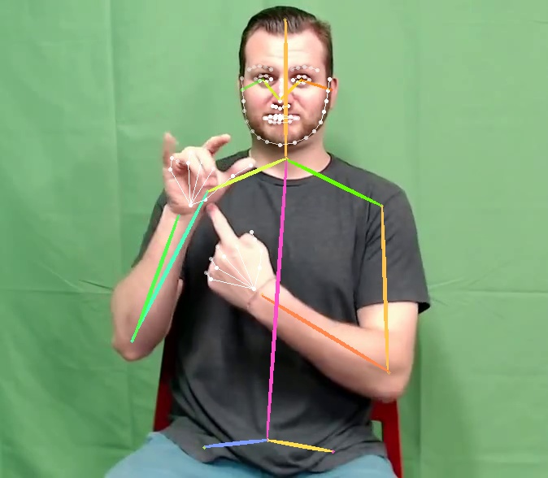

# AlphaPose: Environment & Inference Instructions


>
>
>An example output frame produced by the inference script, showing the detected human pose overlay


This README explains how to **install** and **run** AlphaPose on a CUDA 11.8 cluster using two helper scripts you created:

- `pose_estimators/alphapose/environment_setup.sh` — builds a fully working env and installs AlphaPose in *develop* mode.
- `pose_estimators/alphapose/inference.sh` — runs inference on a video and (optionally) rewrites the output to a broadly compatible H.264 MP4.

> ⚠️ Model weights and some detector files must be downloaded exactly as instructed by the **official AlphaPose repo**:  
> https://github.com/MVIG-SJTU/AlphaPose

---

## Directory Layout (relevant bits)

```
── alphapose/
    ├── environment_setup.sh  # this README refers to it
    └── inference.sh          # this README refers to it
```

---

## Prerequisites

- A cluster/node with:
  - CUDA 11.8 toolchain available as a **module** (or equivalent)  
  - A100 GPUs (or compatible NVIDIA GPUs)
  - Anaconda/Miniconda + **mamba**
  - `module` system for loading toolchains (as used in the scripts)
- Internet access to download Python wheels and model weights
- (Optional but recommended) `ffmpeg` available in your environment (the script uses it for a final H.264 compatibility pass).

> The scripts assume module names:
> - `a100`
> - `cuda/11.8.0`
> - `anaconda3/2024.02-1`
> - `mamba/24.9.0-0`
>
> If your cluster uses different names, **edit the `module load ...` lines** accordingly.

---

## What the scripts do

### 1) `environment_setup.sh`

This script:
1. Loads required modules
2. Clones **AlphaPose**
3. Creates and activates a `conda` environment named **`alphapose`** (Python 3.10)
4. Installs PyTorch **2.5.1 + CUDA 11.8** via `mamba`
5. Pins `pip` and `setuptools` to versions that work with `setup.py develop`
6. Installs all Python dependencies with **known‑good pins** to avoid NumPy/opencv breakages (NumPy 1.26.4 + OpenCV 4.11.0.86)
7. Installs `pycocotools`, `halpecocotools`, and **`cython-bbox==0.1.5`** without build isolation
8. Builds AlphaPose via `python setup.py build develop`

> These pins reflect a configuration **proven to work** on the cluster. In particular:
> - `numpy==1.26.4` avoids legacy `np.float` issues in some dependencies
> - `opencv-python==4.11.0.86` avoids forcing NumPy≥2
> - `PIP_NO_BUILD_ISOLATION=1` ensures compiled deps see the env’s Cython/Numpy
> - `setup.py develop` matches the successful flow you used

**Run it:**
```bash
bash /home/gsantm/repositories/pose_estimators_study/pose_estimators/alphapose/inference.sh
```

After a successful run, activate the environment anytime with:
```bash
module load a100
module load cuda/11.8.0
module load anaconda3/2024.02-1
module load mamba/24.9.0-0
conda activate alphapose
```

---

### 2) `inference.sh`

This script:
1. Loads the same modules and activates the `alphapose` env
2. Sets the **config**, **checkpoint**, and **video** paths
3. Runs AlphaPose’s demo inference
4. Re-encodes the produced MP4 to **H.264 + yuv420p** using `ffmpeg` for compatibility (e.g. VS Code, QuickTime, browsers)

**Edit these three variables** to your paths (defaults shown):
```bash
CONFIG="/home/gsantm/repositories/AlphaPose/configs/halpe_coco_wholebody_136/resnet/256x192_res50_lr1e-3_2x-regression.yaml"
CHECKPOINT="/home/gsantm/repositories/AlphaPose/pretrained_models/multi_domain_fast50_regression_256x192.pth"
VIDEO_NAME="/home/gsantm/scripts/pose_estimators/alphapose/test.mp4"
```

**Run it:**
```bash
bash /home/gsantm/repositories/pose_estimators_study/pose_estimators/alphapose/inference.sh
```

Outputs go to:
```
/home/gsantm/repositories/AlphaPose/examples/res/
  ├── AlphaPose_test.mp4            # initial output, may be MPEG-4 Part 2 (mp4v)
  └── AlphaPose_test_h264.mp4       # re-encoded to H.264 (broad compatibility)
```

---

## Model and Detector Files (follow official instructions)

Per the official repo, you must manually download:

1. **Detector weights** (YOLOv3, or YOLOX if preferred)
   - YOLOv3: `yolov3-spp.weights` → place into `detector/yolo/data`
   - YOLOX: download from YOLOX releases and place into `detector/yolox/data`

2. **Pose models** (AlphaPose pretrained weights)  
   - Place into `pretrained_models/`

3. **(Optional) SMPL** model for 3D demo  
   - `basicModel_neutral_lbs_10_207_0_v1.0.0.pkl` → place into `model_files/`

👉 See these sections in the official repo for the *latest links and details*:
- `docs/INSTALL.md`
- `docs/MODEL_ZOO.md`
- The `scripts/inference.sh` usage in the README

> Official repo: https://github.com/MVIG-SJTU/AlphaPose

---

## Quick Start (once models are in place)

```bash
# 1) one-time setup (if not already done)
bash /home/gsantm/repositories/pose_estimators_study/pose_estimators/alphapose/environment_setup.sh

# 2) run inference
bash /home/gsantm/repositories/pose_estimators_study/pose_estimators/alphapose/inference.sh
```

> The script writes a “raw” MP4 first and then re-encodes it to H.264 for compatibility as `AlphaPose_test_h264.mp4`.

---

## Troubleshooting

- **Video won’t play in VS Code / QuickTime / browser**  
  Use the H.264 file produced by the script: `AlphaPose_test_h264.mp4`.  
  If you want AlphaPose to write H.264 directly, you can modify `alphapose/utils/writer.py` to use a different container/codec pair (e.g., AVI+MJPG), but the `ffmpeg` post-pass is simple and reliable.

- **`Could not find encoder for codec_id=27` or “FFMPEG fallback” messages**  
  These happen when OpenCV’s backend can’t open your desired encoder. The `ffmpeg` post-pass solves this robustly.

- **Build errors around `np.float` / `numpy`**  
  Ensure `numpy==1.26.4` is installed *before* building `cython-bbox` (the setup script does this).

- **Build isolation pulls wrong versions**  
  Keep `PIP_NO_BUILD_ISOLATION=1` exported when installing `cython-bbox` and when running `setup.py develop`.

- **Different module names on your cluster**  
  Edit the `module load ...` lines at the top of each script.

---

## Reproducibility Notes (versions/pins)

- Python 3.10
- PyTorch **2.5.1** + CUDA **11.8** (pytorch channel + nvidia)
- `numpy==1.26.4`, `opencv-python==4.11.0.86`
- `cython-bbox==0.1.5` (no build isolation), `cython==3.2.0`
- Common deps: matplotlib 3.10.7, scipy 1.15.3, tqdm 4.67.1, tensorboardx 2.6.4, visdom 0.2.4, etc.

These pins mirror a **known-good** environment on the target cluster and avoid common pitfalls caused by newer NumPy/OpenCV and build isolation.
